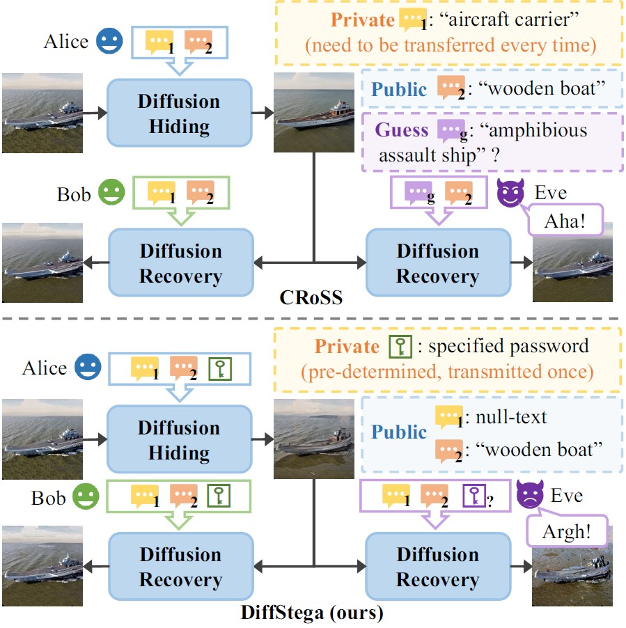
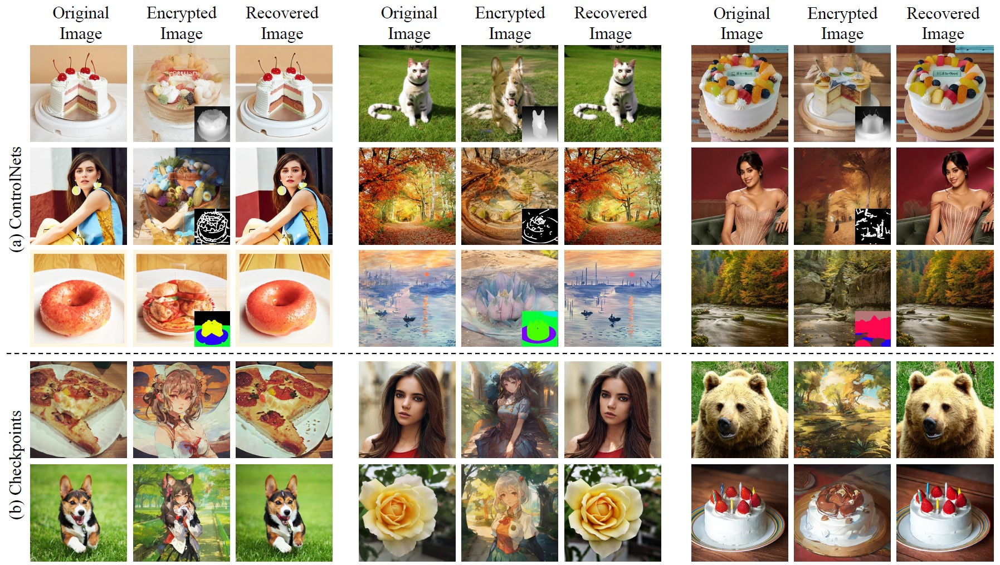

## DiffStega

[IJCAI 2024] Official PyTorch implementation for the paper "DiffStega: Towards Universal Training-Free Coverless Image Steganography with Diffusion Models"

## Setup
Download ip-adapter models and put them into `./pretrained_models`:

- [ip-adapter-plus_sd15.bin](https://huggingface.co/h94/IP-Adapter/blob/main/models/ip-adapter-plus_sd15.bin)
- [ip-adapter-plus-face_sd15.bin](https://huggingface.co/h94/IP-Adapter/blob/main/models/ip-adapter-plus-face_sd15.bin)

Download ip-adapter encoder models and put them into `./pretrained_models/image_encoder_for_ip_adapter`:
- [pytorch_model.bin](https://huggingface.co/h94/IP-Adapter/blob/main/models/image_encoder/pytorch_model.bin)
- [config.json](https://huggingface.co/h94/IP-Adapter/blob/main/models/image_encoder/config.json)

The file structure should be

```angular2html
project
+-- /example
|   +-- 1.png
+-- /pretrained_models
|   +-- /image_encoder_for_ip_adapter
|       +-- config.json
|       +-- pytorch_model.bin
|   +-- ip-adapter-plus_sd15.bin
|   +-- ip-adapter-plus-face_sd15.bin
+-- /output
+-- main.py
+-- scheduling.py
+-- ...
```

Environment setup:
```bash
conda create -n diffstega python=3.11.5
conda activate diffstega
conda install pytorch==2.1.0 torchvision==0.16.0 torchaudio==2.1.0 pytorch-cuda=12.1 -c pytorch -c nvidia
pip install diffusers==0.26.3 accelerate==0.23.0 transformers==4.38.2 controlnet_aux==0.0.7
```
Our test environment is CUDA 12.2, Windows 11 professional 23H2

## Quick run
```bash
# test for style prompt
python main.py --image_path ./example/flickr_dog_000054.jpg --prompt1 "" --prompt2 "a painting by Vincent Willem van Gogh" --save_path ./output/test --optional_control none --edit_strength 0.7 --single_model --rand_seed

# test for content prompt
python main.py --image_path ./example/000000132622.png --prompt1 "" --prompt2 "a wild boar walking through a lush green field" --save_path ./output/test --optional_control seg

# test for similar prompt
python main.py --image_path ./example/00079.png --prompt1 "" --prompt2 "a face of an old woman" --save_path ./output/test --optional_control landmark --pw 1000
```
By default, Diffstega uses null-text as prompt1. You could design prompt1 in line with the original image to achieve better recovery result.

## Parameter description

| args               | description                                           | default | notes                                                                              |
|--------------------|-------------------------------------------------------|---------|------------------------------------------------------------------------------------|
| --pw               | password                                              | 9000    |                                                                                    |
| --num_steps        | sampling step                                         | 50      |                                                                                    |
| --noise_flip_scale | scale of noise flip                                   | 0.05    |                                                                                    |
| --edit_strength    | edit period of diffusion process                      | 0.6     | recommended: 0.7 for style prompts, 0.6 for others                                 |
| --optional_control | optional control information                          | 'none'  | choices=['seg', 'landmark', 'none', 'auto'], 'auto' is used for yaml config inputs |
| --ref_key          | model key or path to the second model                 | 'GraydientPlatformAPI/picx-real' |                                                                                    |
| --rand_pw          | use different random private password for each sample | default=False | action='store_true'|

## Explanation of the results
It will produce results in the output folder.
- **Original/secret** image: `<name>`.png
- **Encrypted/stego** image: `<name>`\_hide_pw_`<correct password>`.png
- **Correctly** recovered/revealed image: `<name>`\_rec_w_`<correct password>`.png
- Wrongly recovered/revealed image **without password**: `<name>`\_rec_wo_`<correct password>`.png
- Wrongly recovered/revealed image **with wrong password**: `<name>`\_rec_wo_`<correct password>`\_w_`<wrong password>`.png
- Reference image with **correct password**: `<name>`\_ref_pw_`<correct password>`.png
- Reference image with **wrong password**: `<name>`\_wrg_pw_`<wrong password>`.png

## Test on Unistega

You can download Unistega from this [link](https://drive.google.com/file/d/1ITaNvYAP8hB32TxwEo4Rdf-515plUOdA/view). Please unzip it into `./dataset` folder. The file structure should be

```angular2html
project
+-- /example
|   +-- 1.png
+-- /dataset
|   +-- /Unistega
|       +-- /content_prompts
|           +-- config.yaml
|           +-- /data
|       +-- /similar_prompts
|       +-- ...
+-- /pretrained_models
+-- /output
+-- main.py
+-- scheduling.py
+-- ...
```

Then use the following commands.
```bash
# for similar prompts
python main.py --yaml_path ./dataset/UniStega/similar_prompts/config.yaml --save_path ./output/UniStega_similar --null_prompt1 --optional_control auto

# for content prompts
python main.py --yaml_path ./dataset/UniStega/content_prompts/config.yaml --save_path ./output/UniStega_content --null_prompt1 --optional_control auto

# for style prompts
python main.py --yaml_path ./dataset/UniStega/style_prompts/config.yaml --save_path ./output/UniStega_style --null_prompt1 --edit_strength 0.7 --single_model --rand_seed --optional_control auto
```

## Introduction

Recent works have utilized text prompts as keys in Coverless image steganography (CIS) through diffusion models. However, this approach faces three challenges: 

- invalidated when private prompt is guessed
- crafting public prompts for semantic diversity
- the risk of prompt leakage during frequent transmission.

To address these issues, we propose DiffStega, an innovative training-free diffusion-based CIS strategy for universal application. DiffStega uses a *password-dependent* reference image as an image prompt alongside the text, ensuring that only authorized parties can retrieve the hidden information. Furthermore, we develop *Noise Flip* technique to further secure the steganography against unauthorized decryption.

<div align="center">

</div>

In this scenario, Alice represents a military organization that Eve regards as a target for espionage. Instead of using text prompt 1 as private key for diffusion-based CIS like previous work ([CRoSS](https://github.com/vvictoryuki/CRoSS)), DiffStega uses *pre-determined password* as private key, and *null-text* as prompt 1. DiffStega has no risk of text prompt leakage, and can encrypt the original image with *arbitrary prompts*.

<div align="center">

</div>

The encrypted and recovered images of DiffStega with different controls (bottom right) and checkpoints of diffusion models. Our pipeline is flexible and applicable to many different modules, bring better imperceptibility while maintaining satisfying recovery results. Note that we still use null-text as prompt 1.

## Acknowledgement
Part of the code is borrowed from [CRoSS](https://github.com/vvictoryuki/CRoSS).

## Citation
If this work is helpful for your research, please consider citing the following BibTeX entry.

```
@inproceedings{yang2024diffStega,
  title={DiffStega: Towards Universal Training-Free Coverless Image Steganography with Diffusion Models},
  author={Yang, Yiwei and Liu, Zheyuan and Jia, Jun and Gao, Zhongpai and Li, Yunhao and Sun, Wei and Liu, Xiaohong and Zhai, Guangtao},
  booktitle={33rd International Joint Conference on Artificial Intelligence (IJCAI)},
  year={2024}
}
```